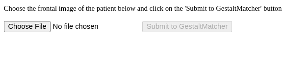

.. PEDIA-Middleware documentation master file, created by
   sphinx-quickstart on Fri Feb 23 15:53:48 2024.
   You can adapt this file completely to your liking, but it should at least
   contain the root `toctree` directive.

Welcome to PEDIA-Middleware's documentation!
============================================

This is a middleware application for handling integration of variant analysis tools like VarFish with PEDIA (Prioritization of Exome data by image analysis). It can be independently embeded as an iFrame in the Variant Analysis tool. It displays a view that takes the patient image as input and submits it to the GestaltMatcher service. It then retrieves the gene list with the gestalt scores from the GestaltMatcher service and posts it back to the parent window (i.e. the tool embedding this application)

    This figure shows the landing page of PEDIA-Middleware application.

.. raw:: latex

    \part{Installation}

.. toctree::
    :maxdepth: 1
    :caption: Installation
    :name: installation
    :hidden:
    :titlesonly:

    pre_requisites
    install_requirements
    app_startup

.. raw:: latex

    \part{Docker}

.. toctree::
    :maxdepth: 1
    :caption: Docker
    :name: docker
    :hidden:
    :titlesonly:

    docker_setup

.. raw:: latex

    \part{Usage}

.. toctree::
    :maxdepth: 1
    :caption: Usage
    :name: usage
    :hidden:
    :titlesonly:

    app_usage

